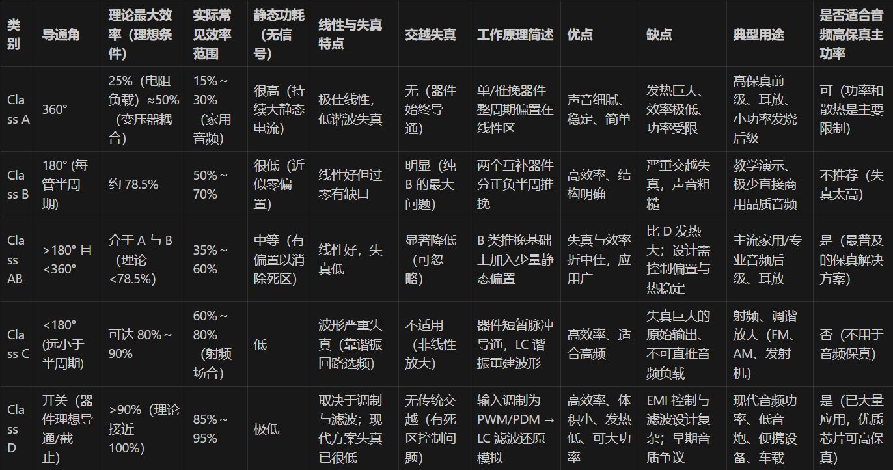

问题：
- 前级双增益
- 确定型号
- 是否对齿音进行处理
- 布线的时候记得按照90Ω的阻抗布线

## 功放不同型号对比

## 使用主板的3.5mm接口还是USB接口，用外置DAC？

- 主板 3.5mm：贴近 CPU、VRM、电感、显卡辐射区，常见底噪包括细微嘶声、滚动电流声、显卡负载变化时的“滋”声。高端主板虽然有独立音频区、金属罩、分层割裂，但仍不如物理外移。

- USB 外置 DAC：把数模与模拟放大搬离机箱内部噪声源，供电再加独立稳压或使用自带的隔离，可降噪底显著。

## 音箱和耳机选择功放类型？是否用同一套？

- 耳机：低噪声、低输出阻抗、毫瓦级~百毫瓦级功率。
- 音箱：瓦级~十数瓦功率、效率与散热控制。

使用“共用前级 + 独立耳机后级 + 独立音箱后级”结构；不要把大功率输出直接硬切给耳机。

1. 输入(DAC/主板) → 音量电位器/缓冲前级。
2. 分路：耳机耳放（独立增益、低噪声）与音箱功放（Class D 或 AB）。
3. 继电器/插孔检测：插耳机自动静音音箱 + 使能耳机。
4. 保护：上电/切换延时、耳机输出直流检测。

## 前后级区别和功能分别是什么？

前级负责“准备并优化信号”（选择/音色/EQ/音量/阻抗与噪声管理），后级负责“把这个已整理好的线路电平放大成能驱动耳机或音箱的功率”。

前级：
- 输入选择 / 缓冲（高输入阻抗，防止源被拖垮）
- 音色整形（如 Baxandall Bass/Treble，或其他 EQ）
- 主音量控制（统一输出电平）
- 小增益或双增益档（匹配不同耳机灵敏度）
- 输出低阻缓冲，给后级干净稳定的驱动
- 降噪是通过“合理的低增益 + 低噪声器件 + 良好接地与屏蔽”实现，而不是主动消噪

后级：
- 大电压/电流放大（瓦级功率）
- 负载控制与阻尼（音箱单元控制力、耳机不失真）
- 效率与散热（Class AB / D 等架构）
- 保护（过流、过温、短路、直流偏置检测）
- 固定或较少改变的增益，信号品质依赖前级准备

设计策略：让前级保持较低且“够用”的增益，后级不再额外放大噪声；系统总增益分配 = 前级少量 + 后级功率。这样底噪最低、调节手感最佳。

## 粗略结构

USB → DAC → 公共前级(见下面主结构) → 分路 → 耳机后级 / 音箱后级 → 各自输出

## 我如果要加入高低频EQ以及音量调节三个旋钮，应该怎么放？

三个旋钮（低频 Bass、高频 Treble、音量 Volume）在整套链路里的最佳放置，一般遵循“输入选择 → 缓冲 → 音色整形 → 主音量 → 低阻缓冲 → 分路后级”的顺序。

核心原则：保证均衡电路有合适的源阻抗与负载阻抗、让音量旋钮控制的是已经整形后的总信号（避免切换耳机/音箱时出现不同音色或噪声被放大）。

主结构（主动 Baxandall）：  
USB → DAC → 输入缓冲/一级小增益 → De‑Ess（齿音动态抑制） → Bass/Treble 有源 Baxandall → 主音量电位器 → 输出缓冲（低阻） → 分路：耳机后级 / 音箱后级

## 主流音频采样和位深选择  | 最终选择 24bit / 192kHz

主流使用频率：
- 16bit / 44.1k：CD 与大量常规流媒体基线。
- 16/24bit / 48k：系统音频、游戏、视频领域标准。
- 24bit / 96k：高分辨率常见档；工程制作与许多 Hi-Res 发行。
- 24bit / 192k：进一步高采样率（滤波余量更大），已足够“高规格”形象；再往上（384k/32bit、DSD）收益递减，多为宣传。

模拟链路的有效动态范围（ENOB）通常 < 21bit；24bit 已提供足够余量。32bit 对模拟输出几乎无实际提升（更多用于内部浮点 / 处理余量）。

提升收益与代价：
- 从 48k → 96k / 192k：主要收益是数字滤波过渡带更宽、潜在相位与高频伪影更低；听感差异在良好系统上细微但存在。
- 从 192k → 384k：收益极小，文件与时钟复杂度上升。优先把资源投入电源、时钟稳定、噪声与布局。
- 从 16bit → 24bit：底噪裕量与处理余量显著提升，是“必要的进阶”。

首板 2ch, 24bit / 44.1, 48, 96, 192 kHz（四档）。比较平衡；后续若固件与时钟验证顺利，可扩展到 384k，不需大改模拟部分。

## USB 输入端设计相关

目标：在靠近电脑机箱强噪声环境的前提下，把 USB 口进来的静电、共模干扰和电源噪声尽量挡在板外。

1. **ESD 静电保护（TVS 二极管）**  
	在 USB 的 D+ / D− 信号线上，并联低电容 TVS（如 SRV05‑4 或专门的 USB ESD 芯片），器件尽量靠近 USB 接口放置，用来吸收插拔时的静电与浪涌，保护 SA9227。

2. **电源滤波（LC 滤波）**  
	USB VBUS（5 V）通常比较“脏”。在 VBUS 上串联一颗磁珠（Ferrite Bead），磁珠后端对地并联 10 µF + 0.1 µF 电容，构成简单的 LC 滤波网络，用于滤除高频噪声与尖峰。

3. **信号串联匹配电阻**  
	在 SA9227 的 D+ / D− 引脚与 USB 接口之间，各串联一颗小电阻（约 22 Ω 或 33 Ω，按 SA9227 Datasheet 推荐值为准）。电阻尽量靠近 SA9227 放置，用于配合芯片内部源阻抗，改善阻抗匹配，减小反射与过冲，同时略微抑制 EMI。

## SA9227 电源部分：接地环路噪声 / 电磁干扰（冰箱启停爆破音）

冰箱压缩机启动瞬间会产生巨大的电压尖峰和电磁脉冲。这个噪声会沿家里的 220 V 电线传导到电脑电源，再经过主板和 USB 地线（GND）进入声卡/功放，最后表现为耳机里的“啪”一声爆破音。

### 1. 外部独立供电

- 如果完全依赖 USB 口供电，耳放/功放的电源直接挂在电脑电源网络上，电脑地线一波动，耳放就跟着波动。  
- 典型做法是：采用外部 12–24 V 适配器供电。  
  - SA9227 的数字部分仍然由 USB 侧供电（问题不大，数字部分对噪声容忍度高）。  
  - DAC 模拟电路和功放芯片的电源全部取自外部适配器，再经本板稳压过滤。  
- 这样，当冰箱等负载干扰电脑电源时，模拟部分吃的是相对干净、独立的适配器电源，相当于在 USB 噪声与模拟电路之间建了一堵墙。

### 2. 增加 USB 共模电感

- 冰箱/开关电源造成的干扰，很多是 D+ / D− 上“同向变化”的共模干扰。普通串联电阻对共模成分抑制有限。  
- 在 D+ / D− 中间加入一颗 USB 共模电感，可以针对这类同向干扰进行衰减，而不会明显损伤真正有用的 USB 差分信号。  

### 3. 确认 SA9227 内部供电

- 确认并实现 SA9227 所需的 1.8 V 核心电源（Core Power）以及各 3.3 V 电源脚，就近布置 0.1 µF 去耦电容与若干 4.7–10 µF 滤波电容，保证芯片本体在噪声冲击时电源不大幅波动。

### 4. I2C 与 EEPROM 相关

- 若后续添加外挂 EEPROM（用于存放配置/固件），在 SDA 和 SCL 线上需要增加 4.7 kΩ 或 2.2 kΩ 上拉电阻到 3.3 V，否则 I2C 通信可能不稳定。  
- EEPROM 本身只在你需要自定义 VID/PID、描述符或更复杂配置时焊接；但推荐在 PCB 上预留焊盘和上拉电阻位置，方便后期扩展。

!!!!!! sa9227转电压

I2C 上拉电阻：在添加 EEPROM 后，SDA 和 SCL 线上别忘了加 4.7kΩ 或 2.2kΩ 的上拉电阻 (Pull-up Resistors) 到 3.3V，否则 I2C 通信会不稳定。

外挂 EEPROM (固件存储)