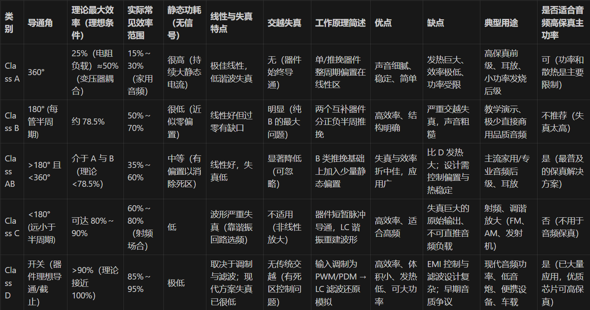

## 设计待办与注意事项

- 前级是否采用双增益方案
- 关键芯片与拓扑型号最终确认
- 是否加入齿音处理（De‑Ess）
- USB 差分线布线按 90 Ω 阻抗控制

## 功放方案选择

### 不同功放型号对比

根据输出功率、效率、失真和发热情况，在多种功放芯片中做权衡：

- 耳机功放侧优先考虑低噪声、低失真、小功率芯片；
- 音箱侧更关注输出功率、效率与散热能力（Class AB / Class D 等）。

### 使用主板 3.5 mm 还是 USB 外置 DAC？

- **主板 3.5 mm**  
	贴近 CPU、VRM、电感、显卡辐射区，常见底噪包括：
	- 细微嘶声、底噪底纹；
	- 滚动电流声；
	- 显卡负载变化时的“滋滋”声。  
	高端主板虽然有独立音频区、金属罩、分层割裂，但整体噪声环境仍不如物理外移。

- **USB 外置 DAC**  
	把数模转换和模拟放大搬离机箱内部强噪声区，再配合独立稳压或隔离供电，可以显著降低噪底，是本项目的优先选择。

## 耳机 / 音箱共用结构设计

### 功率等级与目标

- 耳机：
	- 低噪声、低输出阻抗；
	- 功率范围：毫瓦级 ~ 百毫瓦级；
	- 更敏感于底噪与偏置噪声。

- 音箱：
	- 输出功率：瓦级 ~ 十数瓦；
	- 需要良好的效率与散热设计；
	- 更关注阻尼控制和保护机制。

总体结构采用：**共用前级 + 独立耳机后级 + 独立音箱后级**，避免直接用大功率后级驱动耳机。

典型信号链：

1. 输入（DAC / 主板） → 音量电位器 / 前级缓冲；
2. 分路：
	 - 耳机耳放（独立增益、低噪声）；
	 - 音箱功放（Class D 或 Class AB）；
3. 控制与保护：
	 - 继电器 / 插孔检测：插入耳机自动静音音箱并使能耳机；
	 - 上电 / 切换延时、耳机输出直流检测等保护功能。

## 前级与后级的分工

前级负责“准备并优化信号”，包括：

- 输入源选择与高输入阻抗缓冲（避免拖垮信号源）；
- 音色整形（如 Baxandall Bass / Treble，或其他 EQ）；
- 主音量控制（统一输出电平）；
- 合理的小增益或双增益档（匹配不同耳机灵敏度）；
- 低输出阻抗缓冲，为后级提供干净稳定的驱动；
- 通过低噪声器件、合理增益与良好接地 / 屏蔽降低噪声，而不是依赖主动消噪。

后级负责“功率放大与负载控制”，包括：

- 将线路电平放大到瓦级功率；
- 提供足够的阻尼与控制力，保证音箱单元和耳机不失真；
- 在功率与效率之间做权衡（Class AB / D 等架构）；
- 提供过流、过温、短路、直流偏置检测等保护功能；
- 增益通常固定或少调整，整体音色与噪声由前级决定。

设计策略：

- 前级保持较低但“够用”的增益；
- 后级只做必要的功率放大，不再放大前端噪声；
- 系统总增益 = 前级少量增益 + 后级功率放大；
- 这样能在保证推动力的同时，将整体底噪压到最低，并获得更好的音量旋钮手感。

## 系统粗略结构

整体信号链路：

`USB → DAC → 公共前级（见下文） → 分路 → 耳机后级 / 音箱后级 → 各自输出`

## 三个旋钮（高低频 EQ + 音量）放置位置

目标是在同一套前级中完成：

- 低频提升 / 削减（Bass）；
- 高频提升 / 削减（Treble）；
- 总音量控制（Volume）。

推荐顺序：

`输入选择 → 输入缓冲 → 音色整形（Bass / Treble） → 主音量 → 低阻缓冲 → 分路到耳机 / 音箱后级`

这样可以保证：

- 均衡电路有合适的源阻抗和负载阻抗；
- 主音量旋钮控制的是已经整形好的总信号；
- 切换耳机 / 音箱输出时，音色保持一致，不会因为后级不同导致“EQ 失效”或噪声被额外放大。

一个典型的主动 Baxandall 前级结构：

`USB → DAC → 输入缓冲 / 一级小增益 → De‑Ess（齿音动态抑制） → Bass / Treble 有源 Baxandall → 主音量电位器 → 输出缓冲（低阻） → 分路：耳机后级 / 音箱后级`

## 采样率与位深选择

最终目标：**2 声道，24 bit / 44.1, 48, 96, 192 kHz** 四档采样率。

### 主流配置与用途

- 16 bit / 44.1 k：CD 与大量常规流媒体基线；
- 16 / 24 bit / 48 k：系统音频、游戏、视频领域标准；
- 24 bit / 96 k：常见的高分辨率音频档位；
- 24 bit / 192 k：进一步加宽滤波过渡带，足够“高规格”。

模拟链路的有效动态范围（ENOB）通常小于 21 bit；24 bit 已经提供足够余量，32 bit 更多用于内部处理和工程余量，对最终模拟输出收益有限。

### 提升带来的收益与代价

- 从 48 k 提升到 96 k / 192 k：
	- 数字滤波过渡带更宽，潜在相位与高频伪影更小；
	- 在良好系统上听感差异存在但相对细微；
- 从 192 k 再往上到 384 k / 更高：
	- 收益极小；
	- 文件体积和时钟复杂度显著上升；
	- 资源更应该投入在电源、时钟、噪声与布局优化上；
- 从 16 bit 升到 24 bit：
	- 底噪裕量和处理余量明显提升，是“必要的进阶”。

首板先实现 2ch, 24 bit / 44.1, 48, 96, 192 kHz，后续若固件与时钟验证顺利，可扩展到 384 kHz，而无需大改模拟部分。

## USB 输入端设计相关

目标：在靠近电脑机箱强噪声环境的前提下，把 USB 口进来的静电、共模干扰和电源噪声尽量挡在板外。

1. **ESD 静电保护（TVS 二极管）**  
	在 USB 的 D+ / D− 信号线上，并联低电容 TVS（如 SRV05‑4 或专门的 USB ESD 芯片），器件尽量靠近 USB 接口放置，用来吸收插拔时的静电与浪涌，保护 SA9227。

2. **电源滤波（LC 滤波）**  
	USB VBUS（5 V）通常比较“脏”。在 VBUS 上串联一颗磁珠（Ferrite Bead），磁珠后端对地并联 10 µF + 0.1 µF 电容，构成简单的 LC 滤波网络，用于滤除高频噪声与尖峰。

3. **信号串联匹配电阻**  
	在 SA9227 的 D+ / D− 引脚与 USB 接口之间，各串联一颗小电阻（约 22 Ω 或 33 Ω，按 SA9227 Datasheet 推荐值为准）。电阻尽量靠近 SA9227 放置，用于配合芯片内部源阻抗，改善阻抗匹配，减小反射与过冲，同时略微抑制 EMI。

## SA9227 电源部分：接地环路噪声 / 电磁干扰（冰箱启停爆破音）

冰箱压缩机启动瞬间会产生巨大的电压尖峰和电磁脉冲。这个噪声会沿家里的 220 V 电线传导到电脑电源，再经过主板和 USB 地线（GND）进入声卡/功放，最后表现为耳机里的“啪”一声爆破音。

### 1. 外部独立供电

- 如果完全依赖 USB 口供电，耳放/功放的电源直接挂在电脑电源网络上，电脑地线一波动，耳放就跟着波动。  
- 典型做法是：采用外部 12–24 V 适配器供电。  
  - SA9227 的数字部分仍然由 USB 侧供电（问题不大，数字部分对噪声容忍度高）。  
  - DAC 模拟电路和功放芯片的电源全部取自外部适配器，再经本板稳压过滤。  
- 这样，当冰箱等负载干扰电脑电源时，模拟部分吃的是相对干净、独立的适配器电源，相当于在 USB 噪声与模拟电路之间建了一堵墙。

### 2. 增加 USB 共模电感

- 冰箱/开关电源造成的干扰，很多是 D+ / D− 上“同向变化”的共模干扰。普通串联电阻对共模成分抑制有限。  
- 在 D+ / D− 中间加入一颗 USB 共模电感，可以针对这类同向干扰进行衰减，而不会明显损伤真正有用的 USB 差分信号。  

### 3. 确认 SA9227 内部供电

- 确认并实现 SA9227 所需的 1.8 V 核心电源（Core Power）以及各 3.3 V 电源脚，就近布置 0.1 µF 去耦电容与若干 4.7–10 µF 滤波电容，保证芯片本体在噪声冲击时电源不大幅波动。

### 4. I2C 与 EEPROM 相关

- 若后续添加外挂 EEPROM（用于存放配置/固件），在 SDA 和 SCL 线上需要增加 4.7 kΩ 或 2.2 kΩ 上拉电阻到 3.3 V，否则 I2C 通信可能不稳定。  
- EEPROM 本身只在你需要自定义 VID/PID、描述符或更复杂配置时焊接；但推荐在 PCB 上预留焊盘和上拉电阻位置，方便后期扩展。

### LDO 选择

需求背景：

- 给 SA9227 / DAC / 时钟等提供 1.8 V / 3.3 V 小电流电源；
- 整板尽量只用 0805 MLCC 贴片电容，不放铝电解罐子；
- 电源噪声、纹波和 PSRR 对音频系统很关键。

对比两类常见 LDO：

1. **AMS1117 系列（之前选择）**  
	 - 优点：便宜、常见、可提供较大电流（典型 800 mA）；
	 - 缺点：
		 - 噪声和 PSRR 一般，特别是高频段抑制较弱；
		 - 典型应用需要一定 ESR 的输出电容，最早多配合铝电解；
		 - 全用低 ESR 陶瓷时，若输出电容等效容量偏小（MLCC DC Bias 下降），稳定性边界会变差甚至振荡；
		 - 发热较大，不适合在小面积上长时间高压差工作。

2. **XC6206P182MR（XC6206 系列）**  
	 - 优点：
		 - 面向小电流数字 / 模拟负载设计，噪声低、PSRR 明显优于 AMS1117；
		 - 与 1–4.7 µF 陶瓷电容搭配即可稳定工作，很适合全 MLCC 方案；
		 - 本项目中 DAC / 时钟 / 控制等负载电流不大，200 mA 级别额定电流基本足够；
	 - 缺点：最大电流较低，不适合作为大功率功放级的主电源。

结合 MLCC 的 DC Bias 特性：

- 0805 封装的 22 µF 陶瓷，在 3.3 V 直流偏置下，实际有效容量会掉到 ~15 µF；
- 0603 封装的 22 µF 陶瓷，在 3.3 V 下甚至只剩 5–8 µF；
- 对 AMS1117 这种对输出电容容量和 ESR 较敏感的 LDO 来说，
	容量一旦缩水过多，就有可能不满足稳定性要求 → 产生振荡、纹波变大、底噪提升。

基于以上几点：

- **给 SA9227 / DAC / 时钟等敏感小电流电源，优先选择 XC6206 系列低噪声 LDO；**
- AMS1117 可保留用于不敏感、较大电流的辅助电源（若有），但不推荐放在最关键的音频 / 时钟供电链路中；
- PCB 设计时按 XC6206 datasheet 搭配 1–4.7 µF 0805 X5R/X7R 输入 / 输出电容即可。

## MLCC 的 DC Bias 特性

贴片陶瓷电容（MLCC）有一个重要的物理特性：在直流偏压（DC Bias）下，**实际电容量会下降**。封装越小、标称容量越大，这种容量缩水越明显。

- 一颗 0805 封装、标称 22 µF 的 MLCC，在 3.3 V 电压下，实际容量可能只剩下约 15 µF；
- 一颗 0603 封装、标称 22 µF 的 MLCC，在 3.3 V 电压下，实际容量甚至可能只剩下 5–8 µF（缩水超过 60%）。

**影响：**

- 对 AMS1117 这类对输出电容值和 ESR 比较敏感的 LDO：
  - 如果按照“22 µF”去设计，但在工作电压下有效容量大幅下降；
  - 实际等效电容可能已经低于 LDO 稳定工作所需的最小值；
  - 结果可能是环路边界变差、甚至产生振荡，表现为输出电压不稳、纹波增大、底噪变大。

**设计对策：**

- 选 LDO 时，优先使用对低 ESR MLCC 友好、且对输出电容要求较宽松的型号（如 XC6206 系列）；
- 选 MLCC 型号时，参考电容厂商提供的 DC Bias 曲线，在目标工作电压下确认“实测容量”仍满足 LDO 要求；
- 关键电源尽量用 0805 或更大封装的 MLCC，避免在大容量场合用 0603 硬塞 22 µF；
- 对 AMS1117 这种老型号，若必须使用，宜配合一定 ESR 的钽 / 铝电解电容，而不是全陶瓷。本项目中关键小电流电源已改用 XC6206，更契合“全 0805 MLCC”的策略。

## I2C 上拉电阻与 EEPROM

在 SA9227 外挂 EEPROM 时，会使用 I2C 总线（SCL / SDA）。I2C 是**开漏 / 开集电极输出**结构，依赖上拉电阻把总线拉到高电平，上拉电阻的数值和位置会直接影响通信质量。

### 1. 为什么必须有上拉电阻？

- I2C 器件的 SCL / SDA 引脚只能主动“拉低”，不能主动“拉高”；
- 线空闲或传输逻辑“1”时，依靠上拉电阻把总线电压拉到 3.3 V；
- 没有上拉电阻时：
  - 总线会悬空，电平不确定，极易被噪声干扰；
  - 起始 / 停止条件、数据位的高电平都不可靠，造成通信错误。

### 2. 上拉电阻的典型取值

- 常用范围：**2.2 kΩ ~ 10 kΩ**（拉到 3.3 V）；
- 本项目推荐：
  - 单板上一颗 EEPROM，总线不长，速率在 100 kHz ~ 400 kHz 之间时：
    - SCL 和 SDA 各用一颗 **4.7 kΩ → 3.3 V**，是比较折中的选择；
  - 若总线很短、器件很少、速率低（100 kHz），也可以适当放大到 6.8 kΩ ~ 10 kΩ 以减小静态电流；
  - 若以后 I2C 挂载更多器件或走线明显变长，再考虑把上拉改成 2.2–3.3 kΩ。

### 3. 连接位置和布线原则

- 上拉电阻一端接 SDA / SCL 总线网名，另一端接 3.3 V（与 SA9227 / EEPROM 同一电源域）；
- 物理位置可以放在 SA9227 或 EEPROM 附近，只要与总线拓扑保持在同一区域即可；
- 同一条总线上不要并太多上拉：
  - 多颗小阻值上拉会使等效阻值过低，导致“拉低时电流过大”，增加功耗和 EMI；
  - 一般每条总线各一组上拉（SCL 一组，SDA 一组）就够用。

### 4. 与 EEPROM 的具体关系（本项目约定）

- 在 SA9227 作为 I2C 主控、外挂一颗 EEPROM（存放配置 / 描述符）时：
  - 在 SDA / SCL 总线上各放置一颗 **4.7 kΩ 上拉到 3.3 V**；
  - PCB 上预留这两颗电阻的焊盘，即便首板不焊 EEPROM，也可以通过焊接电阻方便启用 I2C 调试；
  - 这样后续加 EEPROM 时，只要焊上芯片和上拉电阻，总线就能稳定工作。

！！！！！电源dc还没画（已完成

！！！！！二阶 Sallen-Key 低通滤波器电路（已完成

！！！！！Baxandall电路（已完成

！！！！！多个symbol ne5532用同一个

！！！！！gnda和gndd分开放置